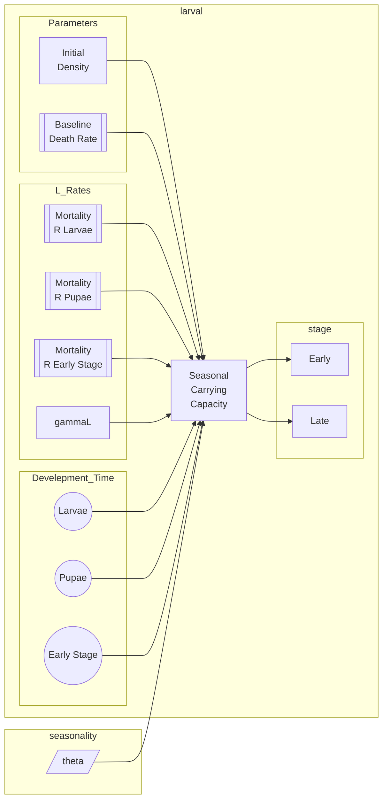

```mermaid
flowchart LR
%%{init: {'flowchart': {'useMaxWidth':false}}}%%
%%%%%%%%%%%
%% seasonality
%%%%%%%%%%%
subgraph seasonality
  theta2[/theta/]
end

subgraph larval\n
  
  subgraph stage
    EL[Early]
    LL[Late]
  end
  KL --> EL
  KL --> LL

  subgraph Develepment_Time
    dLL((Larvae))
    dPL((Pupae))
    dEL((Early Stage))
  end

  subgraph L_Rates
    muLL[[Mortality \n R Larvae]]
    muPL[[Mortality \n R Pupae]]
    muEL[[Mortality \n R Early Stage]]
    gammaL
  end

  subgraph L_Parameters[Parameters]
    mv0[Initial \n Density]
    mu0[[Baseline \n Death Rate]]
  end
    
  KL[Seasonal\n Carrying\n Capacity]

  gammaL & muLL &  muEL & dEL & dLL --> KL
  mv0 & mu0 & dPL & muPL --> KL 
end

theta2 --> KL
```
