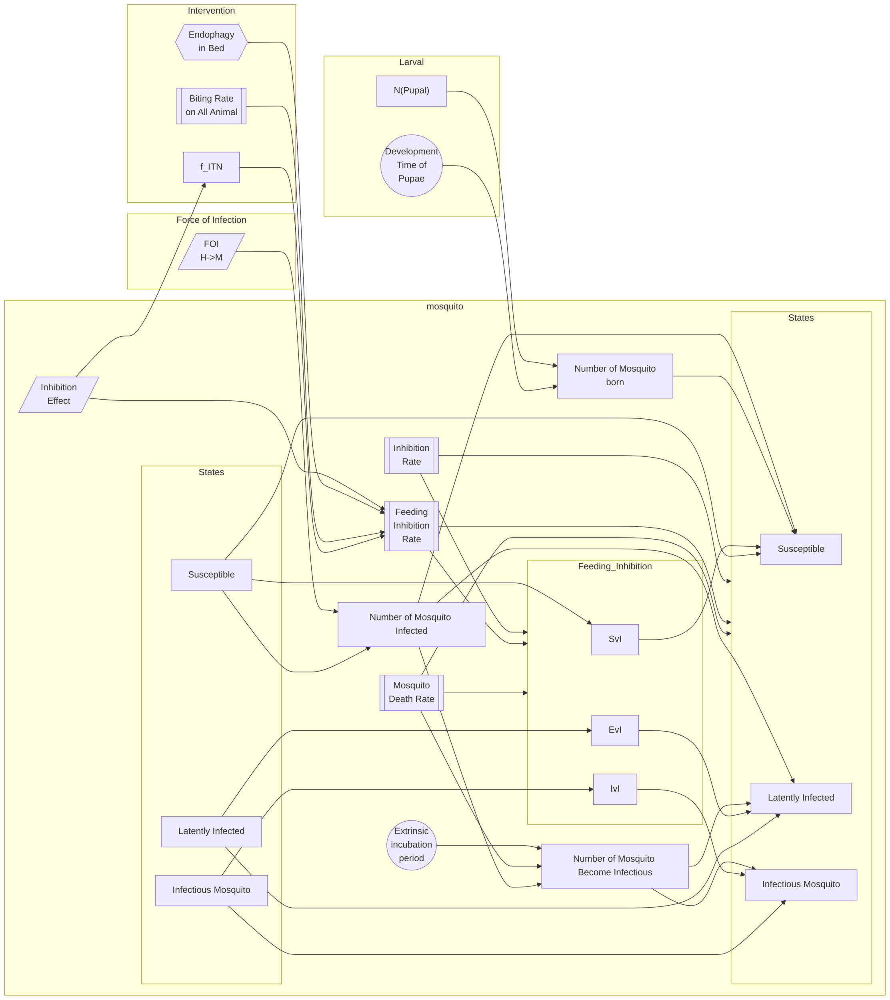

```mermaid
flowchart LR
%%{init: {'flowchart': {'useMaxWidth':false}}}%%
  %%%%%%%%%%%
  %% Mosquito
  %%%%%%%%%%%
  subgraph mosquito

    subgraph mosquito_states_t0 [States]
      Sv_t0[Susceptible]
      Ev_t0[Latently Infected]
      Iv_t0[Infectious Mosquito]
    end

    subgraph mosquito_states_t1 [States]
      Sv_t1[Susceptible]
      Ev_t1[Latently Infected]
      Iv_t1[Infectious Mosquito]
    end

    ince[Number of Mosquito Infected]
    incv[Number of Mosquito Become Infectious]
    delayMos((Extrinsic Incubation Period))

    %% Birth rate
    betaa[Number of Mosquito \n born]

    %% Death rate
    mu[[Mosquito \n Death Rate]]

    %%%%%%%
    %% Feeding Inhibition Mosquitoes
    %%%%%%%
    subgraph Feeding_Inhibition
      SvI
      EvI
      IvI
    end
    %% mv0[/Init Mosq Density/] --> Sv & Ev & Iv

    %% number of mosquitoes become infected at each time point
    inhibition_effect[/Inhibition \n Effect/]
    inhib_rate[[Inhibition \n Rate]]
    feb[[Feeding \n Inhibition \n Rate]]

 end

subgraph FOI_group [Force of Infection]
  delayMos((Extrinsic \n incubation \n period))
  FOIv[/FOI \n H->M/]
end

subgraph Intervention
  f_ITN
  av_mosq[[Biting Rate \n on All Animal]]
  bites_Bed{{Endophagy \n in Bed}}
end
  
subgraph Larval
  PL["N(Pupal)"]
  dPL((Development\n Time of \n Pupae))
end
ince & betaa & SvI & Sv_t0 --> Sv_t1
ince & incv & EvI & Ev_t0 --> Ev_t1
incv & IvI & Iv_t0 --> Iv_t1
delayMos & mu --> incv
inhibition_effect   --> feb      
%% mosquito --> Feeding_Inhibition
Sv_t0 --> SvI
Ev_t0 --> EvI
Iv_t0 --> IvI
bites_Bed --> feb
av_mosq --> feb
inhibition_effect --> f_ITN
inhib_rate --> mosquito_states_t1
inhib_rate --> Feeding_Inhibition
feb --> Feeding_Inhibition
feb --> mosquito_states_t1
mu --> Feeding_Inhibition
mu --> mosquito_states_t1
FOIv & Sv_t0 --> ince
ince --> incv
f_ITN --> feb
PL & dPL --> betaa
```
