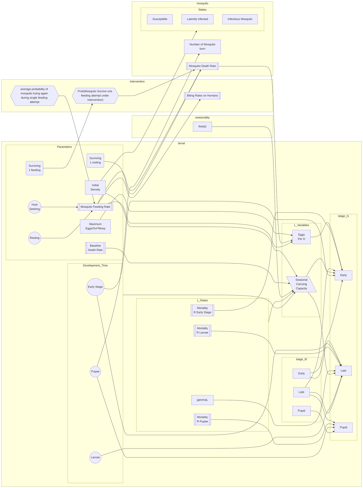

```mermaid
flowchart LR
%%{init: {'flowchart': {'useMaxWidth':false}}}%%
%%%%%%
%% larval states
%%%%%%

subgraph larval
  
  subgraph stage_t0
    EL_t0[Early]
    LL_t0[Late]
    PL_t0[Pupal]
  end

  subgraph stage_t1
    EL_t1[Early]
    LL_t1[Late]
    PL_t1[Pupal]
  end

  subgraph Develepment_Time
    dLL((Larvae))
    dPL((Pupae))
    dEL((Early Stage))
  end

  subgraph L_Rates
    muLL[[Mortality \n R Larvae]]
    muPL[[Mortality \n R Pupae]]
    muEL[[Mortality \n R Early Stage]]
    gammaL
  end

  subgraph L_Parameters[Parameters]
    mv0[Initial \n Density]
    mu0[[Baseline \n Death Rate]]
    tau1((Host \n Seeking))
    tau2((Resting))
    p10(Surviving\n1 feeding)
    p2(Surviving\n1 resting)
    betaL[Maximum\n Eggs/Ovi*Mosq]
    fv[[Mosquito Feeding Rate]]
  end

  subgraph L_Variables
    beta_larval[Eggs \n Per D]
    KL[\Seasonal\n Carrying\n Capacity\]
  end


end

subgraph mosquito
  betaa[Number of Mosquito \n born]
  mu[[Mosquito Death Rate]]
    subgraph mosquito_states_t0 [States]
      Sv_t0[Susceptible]
      Ev_t0[Latently Infected]
      Iv_t0[Infectious Mosquito]
    end
end

subgraph intervention
  zbar{{average probability of mosquito trying again during single feeding attempt}}
  av[[Biting Rates on Humans]]
  p1{{"Prob(Mosquito Survive one feeding attempt under Intervention)"}}
end

subgraph seasonality
  theta2
end

betaL & mu & fv --> beta_larval  
L_Rates --> KL
Develepment_Time --> KL
mv0 & mu0 --> KL 
tau1 & tau2 --> fv
fv & p2 --> mu
p1 --> mu
zbar --> fv
theta2 --> KL
beta_larval & muEL & LL_t0 & KL & dEL & EL_t0 --> EL_t1
EL_t0 & dEL & muLL & gammaL & KL & dLL & LL_t0 --> LL_t1
LL_t0 & muPL & dPL & PL_t0--> PL_t1
p10 --> p1
dPL --> betaa
mv0 --> mosquito_states_t0
fv --> av
```
