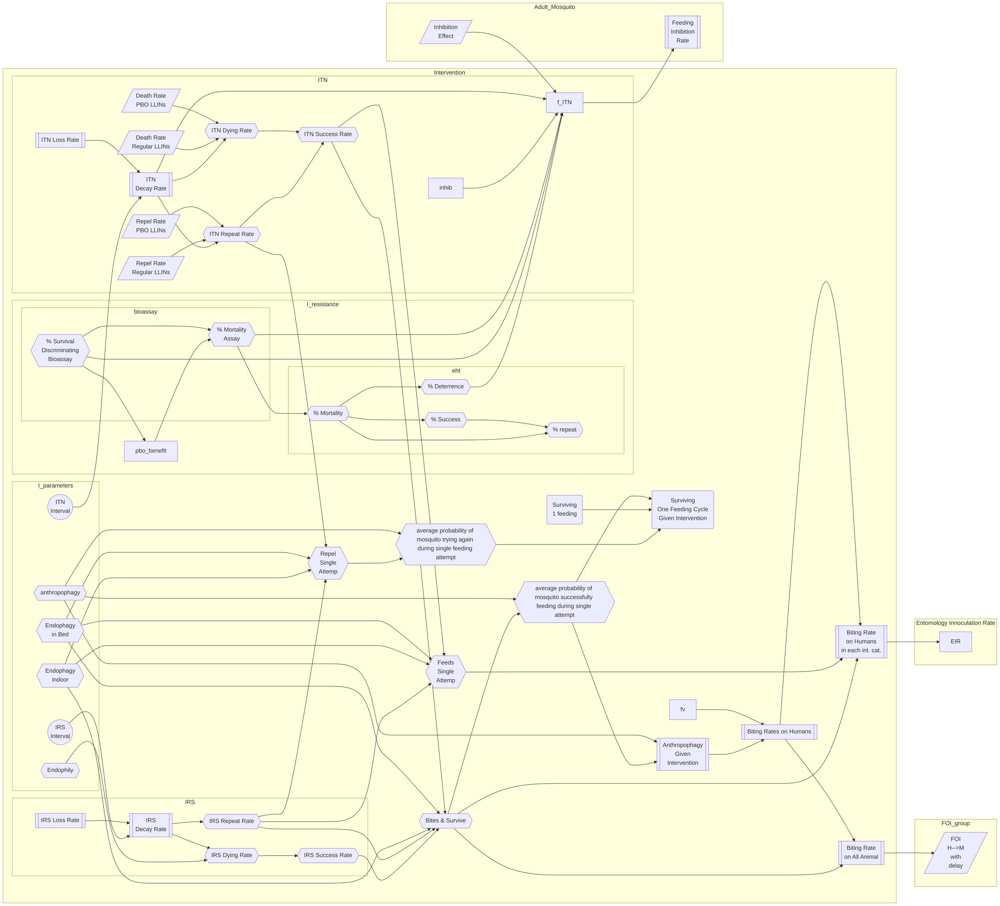

```mermaid
flowchart LR
%%{init: {'flowchart': {'useMaxWidth':false}}}%%
    %%%%%%
    %% intervention
    %%%%%%
    subgraph Intervention
      subgraph I_parameters
        %%itn_cov{{ITN \n Coverage}}
        %%irs_cov{{IRS \n Coverage}}
        ITN_interval((ITN \n Interval))
        IRS_interval((IRS \n Interval))
        chi{{Endophily}}
        Q0{{anthropophagy}}
        bites_Bed{{Endophagy \n in Bed}}
        bites_Indoors{{Endophagy \n indoor}}
      end

      %%subgraph I_outcomes
        %%r[("P(Repeat)")]
        %%d[("P(Dying)")]
        %%s[("P(Success)")]
      %%end

      subgraph I_resistance
        subgraph bioassay
          surv_bioassay{{% Survival\n Discriminating \n Bioassay}}
          mort_assay{{% Mortality \n Assay}}
        end

        subgraph eht
          mort_hut{{% Mortality}}
          det_hut{{% Deterrence}}
          suc_hut{{% Success}}
          rep_hut{{% repeat}}
        end

          mort_assay --> mort_hut
          mort_hut --> det_hut
          mort_hut --> suc_hut
          suc_hut & mort_hut --> rep_hut
          surv_bioassay --> pbo_benefit
          surv_bioassay & pbo_benefit --> mort_assay
      end

      subgraph ITN
        ITN_decay[[ITN \n Decay Rate]]
        itn_loss[[ITN Loss Rate]]
        d_ITN{{ITN Dying Rate}}
        r_ITN{{ITN Repeat Rate}}
        s_ITN{{ITN Success Rate}}
        f_ITN
        d_PBO[/Death Rate \n PBO LLINs/]
        d_Regular[/Death Rate \n Regular LLINs/]
        r_PBO[/Repel Rate \n PBO LLINs/]
        r_Regular[/Repel Rate \n Regular LLINs/]

        %%halflife
        %% mort_hut --> wash_decay_rate[[Wash \n Decay \n]]
        itn_loss & ITN_interval --> ITN_decay

        %% connections
        d_PBO & d_Regular & ITN_decay --> d_ITN
        r_PBO & r_Regular & ITN_decay --> r_ITN
        d_ITN & r_ITN --> s_ITN
        ITN_decay & det_hut & mort_assay --> f_ITN 
        inhib --> f_ITN
      end

      subgraph IRS
        IRS_decay[[IRS \n Decay Rate]]
        irs_loss[[IRS Loss Rate]]
        r_IRS{{IRS Repeat Rate}}
        d_IRS{{IRS Dying Rate}}
        s_IRS{{IRS Success Rate}}

        irs_loss & IRS_interval --> IRS_decay
        IRS_decay --> r_IRS & d_IRS
        chi --> d_IRS
        d_IRS --> s_IRS
      end
      
      p_bites_survive{{"Bites & Survive"}}
      p_feed_single_attemp{{Feeds \n Single \n Attemp}}
      p_repel_single_attemp{{Repel \n Single \n Attemp}}
      zbar{{average probability of mosquito trying again during single feeding attempt}}
      wbar{{average probability of mosquito successfully feeding during single attempt}}
      p10(Surviving\n1 feeding)
      p1(Surviving\nOne Feeding Cycle \nGiven Intervention)
      Q[[Anthropophagy \n Given \n Intervention]]
      av[[Biting Rates on Humans]]
      av_mosq[[Biting Rate \n on All Animal]]
      av_human[[Biting Rate \n on Humans \n in each int. cat.]]

      bites_Bed & bites_Indoors & r_IRS & s_IRS & s_ITN --> p_bites_survive
      bites_Bed &  bites_Indoors & r_IRS & s_ITN --> p_feed_single_attemp
      bites_Bed & bites_Indoors & r_ITN & r_IRS --> p_repel_single_attemp

      Q0 & p_repel_single_attemp --> zbar
      Q0 & p_bites_survive --> wbar

      wbar & p10 & zbar --> p1
      Q0 & wbar --> Q
      fv & Q --> av

      av & p_bites_survive --> av_mosq
      av & p_feed_single_attemp & p_bites_survive --> av_human
      
    end

subgraph Adult_Mosquito
  feb[[Feeding \n Inhibition \n Rate]]
  inhibition_effect[/Inhibition \n Effect/]
  surv_bioassay{{% Survival\n Discriminating \n Bioassay}}
end

subgraph FOI_group
  FOIvijk[/"FOI \n H-->M \n with \n delay"/]
end

subgraph EIR_group [Entomology Innoculation Rate]
  EIR
end

inhibition_effect --> f_ITN
surv_bioassay --> f_ITN
f_ITN --> feb
av_mosq --> FOIvijk
av_human --> EIR
```
