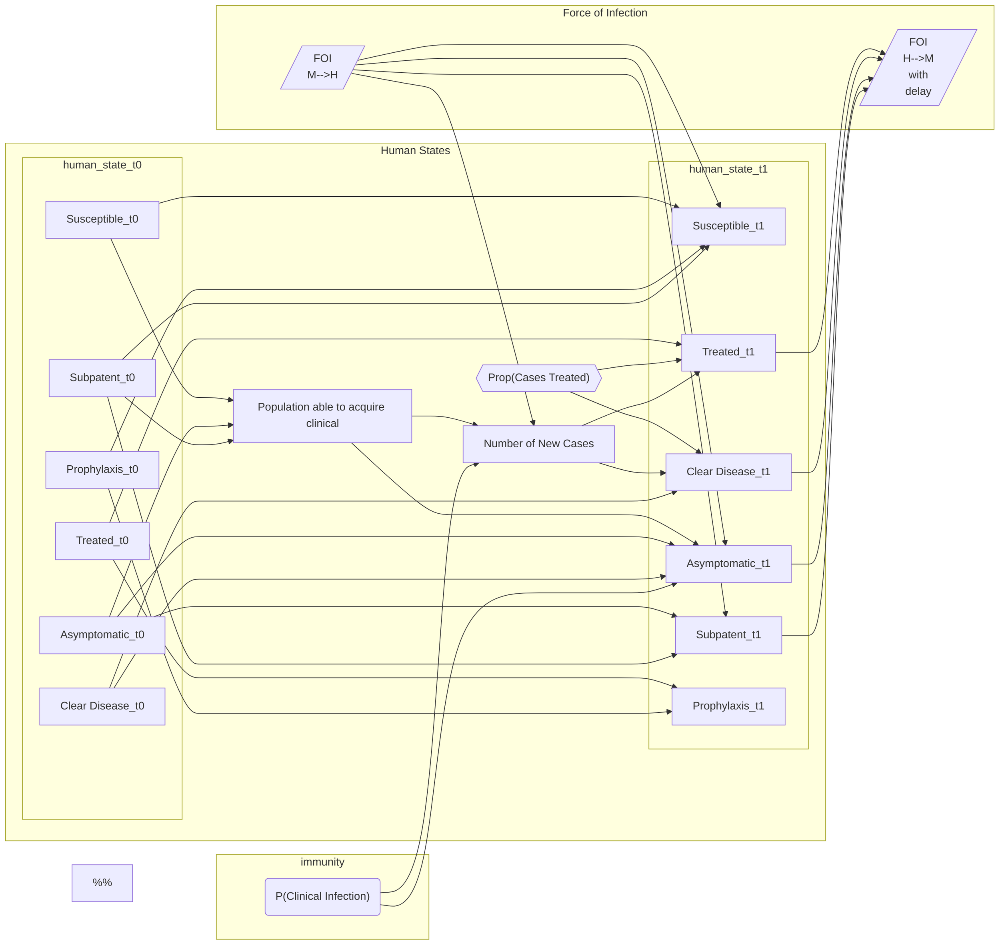
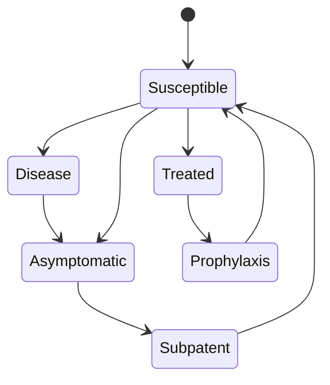

```mermaid
%%{init: {'flowchart': {'useMaxWidth':false}}}%%
flowchart LR
    %% Implemented by Chunzhe ZHANG (zhangc@who.int)
    %% reinterpretation of odin_model_ITN_inhib_kegara.R

    %%
    %%subgraph init
        %%na["N(Age Categories)"]
        %%nh["N(Biting Categories)"]
        %%num_int
    %%end
    %%init --> 1_human

    subgraph 1_human [Human States]

      ft{{"Prop(Cases Treated)"}}
      Y --> clin_inc[Number of New Cases]

      %%subgraph 1_human:1_state [Human State]
      subgraph human_state_t0
        S_t0[Susceptible_t0]
        A_t0[Asymptomatic_t0]
        T_t0[Treated_t0]
        D_t0[Clear Disease_t0]
        U_t0[Subpatent_t0]
        P_t0[Prophylaxis_t0]
      end

      subgraph human_state_t1
        S_t1[Susceptible_t1]
        A_t1[Asymptomatic_t1]
        T_t1[Treated_t1]
        D_t1[Clear Disease_t1]
        U_t1[Subpatent_t1]
        P_t1[Prophylaxis_t1]
      end

      S_t0 & P_t0 & U_t0 --> S_t1
      T_t0 & ft & clin_inc --> T_t1
      ft & clin_inc & D_t0 --> D_t1
      Y & A_t0 & D_t0 --> A_t1
      A_t0 & U_t0 --> U_t1
      T_t0 & P_t0 --> P_t1
      S_t0 & A_t0 & U_t0 --> Y[Population able to acquire clinical]

      %% Total Population
      %% H[Total Population]

      %% new cases at this Timestep

      %% Malaria Disease State Change Rate
      %% subgraph 1_human:2_state_change_rate
        %%rA[["R(A->U)"]]
        %%rT[["R(T->P)"]]
        %%rD[["R(D->A)"]]
        %%rU[["R(U->S)"]]
        %%rP[["R(P->S)"]]
      %%end

      %% heterogeneity
      %% subgraph heterogeneity
        %%eta[[Death \n exponential \n population \n distribution]]
        %%age_rate[[Moving \n through \n age categories]]
        %%het_wt[[Weights of \n heterogeneous \n biting \n categories]]
      %%end
    end
    
    subgraph FOI_subgroup [Force of Infection]
      FOI[/"FOI \n M-->H"/]
      FOIvijk[/"FOI \n H-->M \n with \n delay"/]
    end
    FOI --> S_t1 & clin_inc & A_t1 & U_t1
    T_t1 & D_t1 & A_t1 & U_t1 --> FOIvijk

    subgraph immunity
      phi("P(Clinical Infection)") 
    end
    phi --> A_t1 & clin_inc 

```

```mermaid
stateDiagram-v2
  [*] --> Susceptible
  Asymptomatic --> Subpatent
  Treated --> Prophylaxis
  Disease --> Asymptomatic
  Subpatent --> Susceptible
  Prophylaxis --> Susceptible
  Susceptible --> Asymptomatic
  Susceptible --> Disease
  Susceptible --> Treated 
```
