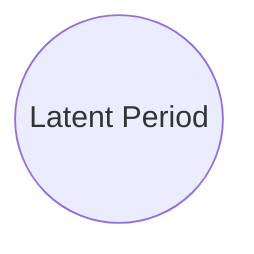

# Implementation of Imperial Malaria Model

## Diagram

```mermaid
%%{init: {'flowchart': {'useMaxWidth':false}}}%%
flowchart LR
    %% Implemented by Chunzhe ZHANG (zhangc@who.int)
    %% reinterpretation of odin_model_ITN_inhib_kegara.R

    %%
    %%subgraph init
    %%    na["N(Age Categories)"]
    %%    nh["N(Biting Categories)"]
    %%    num_int
    %%end

    subgraph 1_human [Human States]

      %%subgraph 1_human:1_state [Human State]
        S[Susceptible]
        A[Asymptomatic]
        T[Treated]
        D[Clear Disease]
        U[Subpatent]

        ft{{"Prop(Cases Treated)"}}

        %% Total N of population
        P[Prophylaxis]

        S & A & U --> Y[Population able to acquire clinical]

        %% Total Population
        H[Total Population]

        %% new cases at this Timestep
        Y --> clin_inc[New Cases]

        %% human states
        P & U  --> S
        ft & clin_inc --> T
        ft & clin_inc --> D
        Y --> A
        A --> U
        T --> P
      %%end

      %% Malaria Disease State Change Rate
      %% subgraph 1_human:2_state_change_rate
        %%rA[["R(A->U)"]]
        %%rT[["R(T->P)"]]
        %%rD[["R(D->A)"]]
        %%rU[["R(U->S)"]]
        %%rP[["R(P->S)"]]
      %%end

      %% state_change_rate ==> state

      %% heterogeneity
      %%subgraph heterogeneity
        %%eta[[Death \n exponential \n population \n distribution]]
        %%age_rate[[Moving \n through \n age categories]]
        %%het_wt[[Weights of \n heterogeneous \n biting \n categories]]
      %%end
      
      %% heterogeneity ==> state
    end
    

    %%
    %% end of human part %%
    %%


    %%%%%%%%%%%
    %% immunity
    %%%%%%%%%%%


    subgraph immunity

      %%subgraph immunity_decay_scale
        %%dCM[[Decay \n Maternal]]
        %%dCA[[Decay \n Clinical]]
        %%dID[[Decay \n Detection]]
        %%dB[[Decay \n Infection \n Blocking]]
        %%uB[/Scale \n Infection \n Blocking/]
        %%uCA[/Scale \n Clinical/]
        %%uD[/Scale \n ID/]
        %%PM[/immunity \n constant/]
      %%end

      subgraph level
        ICM[Maternal \n Immunity] %% maternal
        ICA[Immunity \n Previous Infection] %% previous infection
        IC[Clinical \n Immunity] %% clinical immunity
        IB[Infection \n Blocking] %% infection blocking, chances of preventing infection upon receiving infectious bites
        ID[Detection \n Immunity] %% Detection immunity, immunity suppresses parasite densities and make it less likely been diagnostics
      end

      %% immunity_decay_scale ==> level

      ICM & ICA --> IC
      ICA --> ICM

      %% phi
      %% phi0[/phi0/] & phi1[/phi1/] & kC[/kC/] --> phi
      phi(["P(Clinical Infection)"]) --> clin_inc & A
      IC --> phi

      %% b: probability of infection from a infectious bite
      %% b0[/b0/] & b1[/b1/] & kB[/kB/] & IB0[/IB0/] --> b("P(Infectious Bite --> Disease)")
      IB --> b("P(Infectious Bite --> Disease)")

      %% ID detection immunity

      %% probability of detection by microscopy
      %% aD[[aD] % fD0[[fD0]] % gammaD[[gammaD]] % d1[[d1]] % ID0[[ID0]] % kD[[kD]]
      %% fD0 & aD & gammaD --> fd
      %% d1 & fd & ID & ID0 & kD --> p_det
      p_det("P(Detection by Microscopy)")

    end

    EIR --> IB
    FOI --> ID

    subgraph EIR_group [Entomology Innoculation Rate]

      %% EIR
      foi_age[/FOI for age group/]
      rel_foi[[Rate FOI]]
      foi_age & rel_foi --> EIR
      %%omega -->EIR


    end

    Iv --> EIR
    av_human --> EIR
    FOI --> ICA
    EIR --> FOI

    %% end of immunity

    %%%%%%%%%%%
    %% seasonality
    %%%%%%%%%%%
    subgraph seasonality
      theta2[/theta/]
    end

    %%%%%%%%%%%
    %% Mosquito
    %%%%%%%%%%%
    subgraph mosquito

      subgraph mosquito_states [States]
        Sv[Susceptible]
        Ev[Latently Infected]
        Iv[Infectious Mosquito]

        Sv --> Ev
      end
      %% mv0[/Init Mosq Density/] --> Sv & Ev & Iv

      %% infectiousness from human to mosquito
      subgraph infectiousness_h_m ["Infectiousness: Human --> Mosq"]
        cU[/"U-->Mosq"/]
        cD[/"D-->Mosq"/]
        cT[/"T-->Mosq"/]
        gamma1[/gamma1/]
        cA[/"A-->Mosq"/]
        cU & cD & gamma1 --> cA
      end

      %% number of mosquitoes become infected at each time point
      %% need to read paper
      subgraph mosquito_population_change_rate

        mu[[Mosquito \n Death Rate]]
        delayMos & mu --> incv[Increased Susceptible \n Mosquito \n Per Unit Time]

        %% birth
        betaa[Mosquito \n born]
      end

      ince & mu & betaa & feb  & inhib_rate & SvI --> Sv
      ince & incv & mu & feb & inhib_rate & EvI --> Ev
      incv & mu & feb & inhib_rate & IvI --> Iv


      %%%%%%%
      %% Feeding Inhibition Mosquitoes
      %%%%%%%
      subgraph Feeding_Inhibition
        inhibition_effect[/Inhibition \n Effect/]
        inhib_rate[[Inhibition \n Rate]]
        
        subgraph Inhibition
          SvI
          EvI
          IvI
        end

        subgraph Rates
          feb
          inhib_rate
        end

        Rates ==> Inhibition

        PBO_p[[PBO \n Inhibition \n Magnitude]]
        G2_p[[G2 \n Inhibition \n Magnitude]]

        PBO_p & G2_p --> inhib[inhib]
        inhibition_effect & av_mosq --> feb[[Feeding \n Inhibition \n Rate]]
      end

      bites_Bed --> feb
      surv_bioassay --> inhib
      mu --> Feeding_Inhibition
      %% mosquito --> Feeding_Inhibition

    end
    
    f_ITN --> feb
    PL & dPL --> betaa
    p_det --> cA

    subgraph FOI_group [Force of Infection]

      %% FOI
      %% EIR & IB & b --> FOI_lag((FOI_lag))
      %% b0 --> FOI_lag
      dE((Latent Period))
      IB & b & dE --> FOI[/"FOI \n M-->H"/]
      FOI --> S & U & A & clin_inc

      T & D & A & U & rel_foi & av_mosq & foi_age --> FOIvijk[/"FOI \n H-->M \n with \n delay"/]
      %%omega --> FOIvijk

      %% Force of infection from Human to Mosquito
      delayGam((Parasites \n to \n Infectious \n gametocypes))
      delayMos((Extrinsic \n incubation \n period))
      
      FOIvijk & delayGam --> FOIv[/FOI \n H->M/]

    end

    cU & cT & cD & cA --> FOIvijk
    FOIv --> Iv & Ev & Sv


    %%%%%%
    %% larval states
    %%%%%%

    subgraph larval\n
      
      subgraph stage
        EL[Early]
        LL[Late]
        PL[Pupal]
      end
      beta_larval & muEL & LL & KL & dEL --> EL
      EL & dEL & muLL & gammaL & KL & dLL --> LL
      LL & muPL & dPL --> PL

      subgraph Develepment_Time
        dLL((Larvae))
        dPL((Pupae))
        dEL((Early Stage))
      end

      subgraph L_Rates
        muLL[[Mortality \n R Larvae]]
        muPL[[Mortality \n R Pupae]]
        muEL[[Mortality \n R Early Stage]]
        gammaL
      end

      subgraph L_Parameters[Parameters]
        mv0[Initial \n Density]
        mu0[[Baseline \n Death Rate]]
        tau1((Host \n Seeking))
        tau2((Resting))
        p10(Surviving\n1 feeding)
        p2(Surviving\n1 resting)
        betaL[Maximum\n Eggs/Ovi*Mosq]
        fv[[Feeding \n Rate]]
      end

      subgraph L_Variables
        betaL & mu & fv --> eov --> beta_larval[Eggs \n Per D]
        mu & fv --> beta_larval
        gammaL & muLL &  muEL & dEL & dLL --> KL[Seasonal\n Carrying\n Capacity]
        mv0 & mu0 & dPL & muPL --> KL 
        tau1 & tau2 --> fv
        fv & p2 --> mu
      end
    end
    p1 --> mu
    zbar --> fv
    theta2 --> KL

    %%%%%%
    %% intervention
    %%%%%%
    subgraph Intervention
      subgraph I_parameters
        itn_cov{{ITN \n Coverage}}
        irs_cov{{IRS \n Coverage}}
        ITN_interval((ITN \n Interval))
        IRS_interval((IRS \n Interval))
        chi{{Endophily}}
        Q0{{anthropophagy}}
        bites_Bed{{Endophagy \n in Bed}}
        bites_Indoors{{Endophagy \n indoor}}
      end

      %%subgraph I_outcomes
        %%r[("P(Repeat)")]
        %%d[("P(Dying)")]
        %%s[("P(Success)")]
      %%end

      subgraph I_resistance
        subgraph bioassay
          surv_bioassay{{% Survival\n Discriminating \n Bioassay}}
          surv_bioassay --> pbo_benefit
          surv_bioassay & pbo_benefit --> mort_assay{{% Mortality \n Assay}}
        end

        subgraph eht
          mort_assay --> mort_hut{{% Mortality}}
          mort_hut --> det_hut{{% Deterrence}}
          mort_hut --> suc_hut{{% Success}}
          suc_hut & mort_hut --> rep_hut{{% repeat}}
        end

      end
      subgraph ITN
        ITN_decay[[ITN \n Decay Rate]]
        itn_loss[[ITN Loss Rate]]
        d_ITN{{ITN Dying Rate}}
        r_ITN{{ITN Repeat Rate}}
        s_ITN{{ITN Success Rate}}
        f_ITN
        d_PBO[/Death Rate \n PBO LLINs/]
        d_Regular[/Death Rate \n Regular LLINs/]
        r_PBO[/Repel Rate \n PBO LLINs/]
        r_Regular[/Repel Rate \n Regular LLINs/]

        %%halflife
        %% mort_hut --> wash_decay_rate[[Wash \n Decay \n]]
        itn_loss & ITN_interval --> ITN_decay

        %% connections
        d_PBO & d_Regular & ITN_decay --> d_ITN
        r_PBO & r_Regular & ITN_decay --> r_ITN
        d_ITN & r_ITN --> s_ITN
        ITN_decay & det_hut & mort_assay --> f_ITN 
        inhib --> f_ITN
        inhibition_effect --> f_ITN
        surv_bioassay --> f_ITN
      end

      subgraph IRS
        IRS_decay[[IRS \n Decay Rate]]
        irs_loss[[IRS Loss Rate]]
        r_IRS{{IRS Repeat Rate}}
        d_IRS{{IRS Dying Rate}}
        s_IRS{{IRS Success Rate}}

        irs_loss & IRS_interval --> IRS_decay
        IRS_decay --> r_IRS & d_IRS
        chi --> d_IRS
        d_IRS --> s_ITS
      end
      
      p_bites_survive{{"Bites & Survive"}}
      bites_Bed & bites_Indoors & r_IRS & s_IRS & s_ITN --> p_bites_survive

      p_feed_single_attemp{{Feeds \n Single \n Attemp}}
      bites_Bed &  bites_Indoors & r_IRS & s_ITN --> p_feed_single_attemp

      p_repel_single_attemp{{Repel \n Single \n Attemp}}
      bites_Bed & bites_Indoors & r_ITN & r_IRS --> p_repel_single_attemp

      zbar{{average probability of mosquito trying again during single feeding attempt}}
      wbar{{average probability of mosquito successfully feeding during single attempt}}
      Q0 & p_repel_single_attemp --> zbar
      Q0 & p_bites_survive --> wbar

      wbar & p10 & zbar --> p1
      Q0 & wbar --> Q[[Anthropophagy \n Given \n Intervention]]
      fv & Q --> av[[Biting Rates on Humans]]

      av & p_bites_survive --> av_mosq[[Biting Rate \n on All Animal]]
      av & p_feed_single_attemp & p_bites_survive --> av_human[[Biting Rate \n on Humans \n in each int. cat.]]


      wbar{{average probability of mosquito successfully feeding during single attempt}}
      
    end

    %% Disc_Mort(Discriminating Bioassay Mortality) --> PBO_Benifit(PBO Benifits against Regular LLINs)
    %% mort_hut --> det_hut(EHT Deterrence)
    %% mort_hut --> suc_hut(EHT Success Feed)
    %% suc_hut --> rep_hut(EHT Repeat)
    %% mort_hut --> rep_hut
    %% hut_max(maximun mortality seen in huts)
    %% my_max_washes(maximun washes of an ITN)
    %% mort_hut --> wash_decay_rate
    %% itn_half_life(ITN half life)
    %% pbo_half_life(PBO half life)

    %% types of variables
    classDef pr fill:#f9f,stroke:#333,stroke-width:4px;
    classDef po fill:#000;
    classDef n fill:#fff;
    classDef h fill:
    classDef unimportant stroke-dasharray: 5 5;

    class b0,b1,kB,IB0,kC,het_wt,init_S,phi1,phi0 unimportant

```

## Types of Variables

```mermaid
flowchart LR
Proportion{{Proportion Example}}
itn_cov{{ITN \n Coverage}}    
Probability([Probability Example])
phi(["Probability(Clinical Infection)"])
number[Number Example]
S["Number(Susceptible Population)"]
Rate[[Rate Example]]
Duration((Duration\n Example))
delayMos((Extrinsic \n incubation \n period))    
NoUnit[/NoUnit\nExample/]
FOI[/"Force of Infection \n Mosquito-->Human"/
```

### 1. Proportion


### 2. Possibility


### 3. Number: Squared Nodes


### 4. Rate


### 5. Duration



### 6. No Unit


## Parts

### 1. Human

### 2. Vector

### 3. Intervention
