# Implementation of Imperial Malaria Model

## Diagram

```mermaid
graph TD
    %% reinterpretation of odin_model_ITN_inhib_kegara.R
    ft{{"Prop(Cases Treated)"}}

    subgraph init
        na["N(Age Categories)"]
        nh["N(Biting Heterogeneity Categories"]
        num_int
    end

    subgraph state
        S[S]
        A[A]
        T[T]
        D[D]
        U[U]
        P[P]
    end

    %%init-->state

    %% human states
    eta[["R(Death-exponential population distribution)"]]
    age_rate[["R(Moving through age categories)"]]
    het_wt[[Weights of heterogeneous biting categories]]

    %% Malaria Disease State in Human
    rA[["R(A->U)"]]
    rT[["R(T->P)"]]
    rD[["R(D->A)"]]
    rU[["R(U->S)"]]
    rP[["R(P->S)"]]

    FOI

    %% S

    FOI & rP & P & rU & U & eta & H & het_wt & age_rate --> S

    %% T
    ft & clin_inc & rT & eta & age_rate --> T

    %% D
    ft & clin_inc & rD & eta & age_rate --> D

    %% A
    phi & FOI & Y & rD & rA & eta & age_rate --> A

    %% U
    

    Disc_Mort(Discriminating Bioassay Mortality) --> PBO_Benifit(PBO Benifits against Regular LLINs)
    %%PBO_Y_N{PBO} --yes--> PBO_Benifit
    %%PBO_Y_N --no--> Disc_Mort
    Disc_Mort --> mort_hut(EHT Mortality)
    PBO_Benifit --> mort_hut
    mort_hut --> det_hut(EHT Deterrence)
    mort_hut --> suc_hut(EHT Success Feed)
    suc_hut --> rep_hut(EHT Repeat)
    mort_hut --> rep_hut
    hut_max(maximun mortality seen in huts)
    my_max_washes(maximun washes of an ITN)
    mort_hut --> wash_decay_rate
    itn_half_life(ITN half life)
    pbo_half_life(PBO half life)

    %% types of variables
    classDef pr fill:#f9f,stroke:#333,stroke-width:4px;
    classDef po fill:#000;
    classDef n fill:#fff;
    classDef h fill:
    classDef unimportant stroke-dasharray: 5 5;

    class het_wt,init_S unimportant

```

## Types of Variables

### 1. Proportion

### 2. Possibility

### 3. Number: Squared Nodes

### 4. Rate

### 5. No Unit

## Parts

### 1. Human

### 2. Vector

### 3. Intervention
